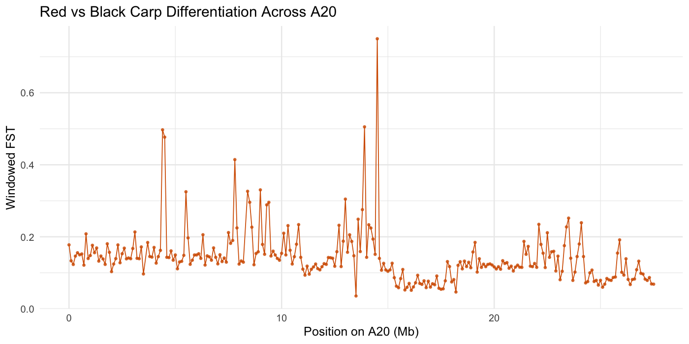
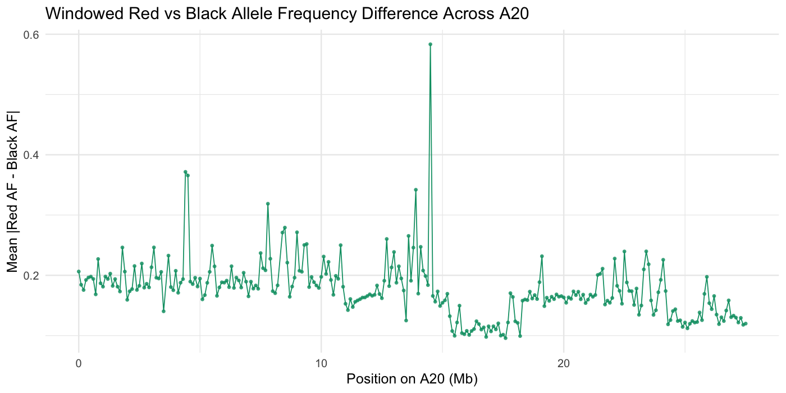
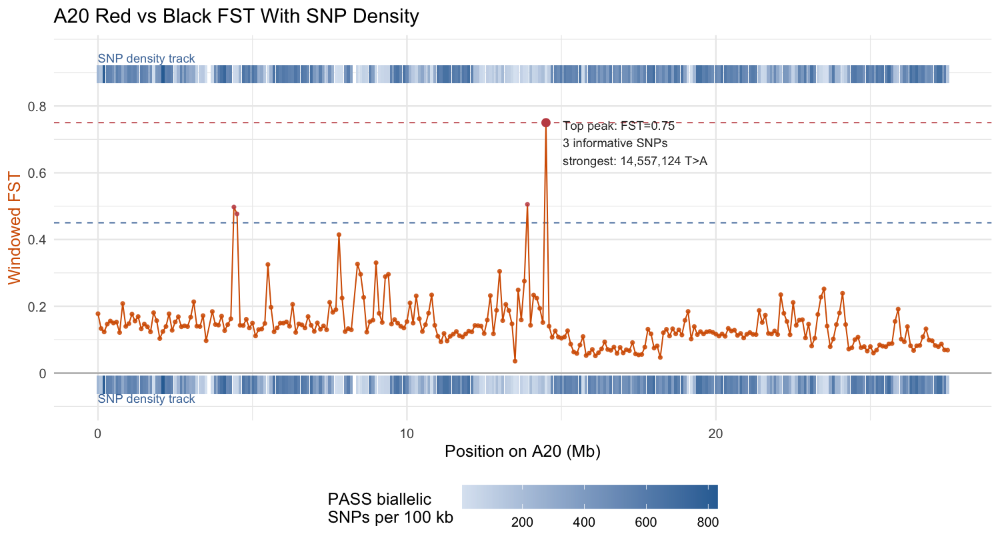
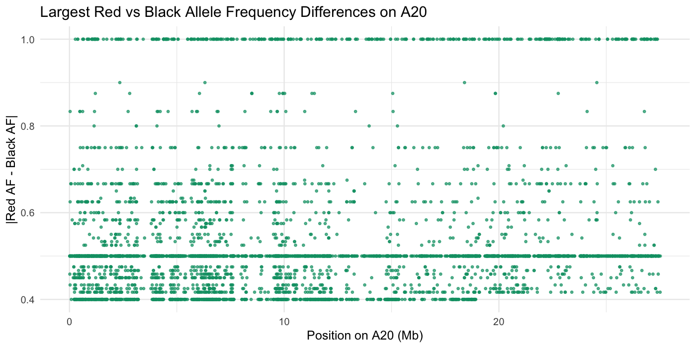
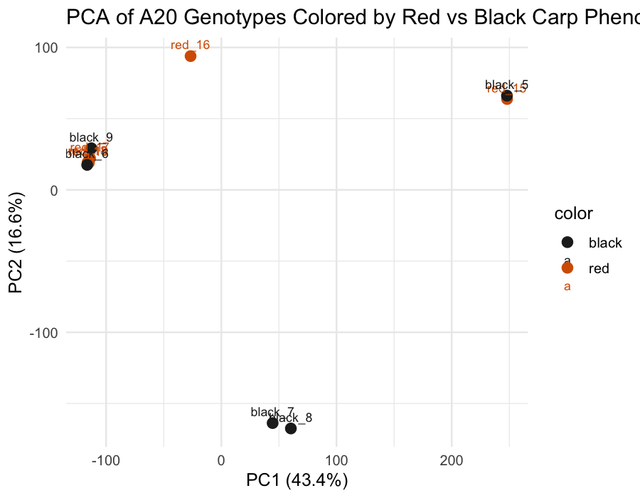
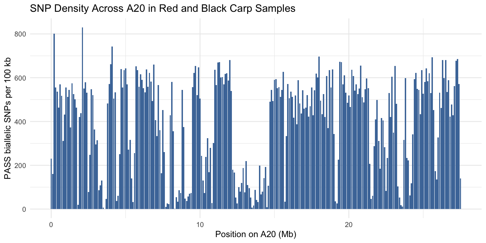
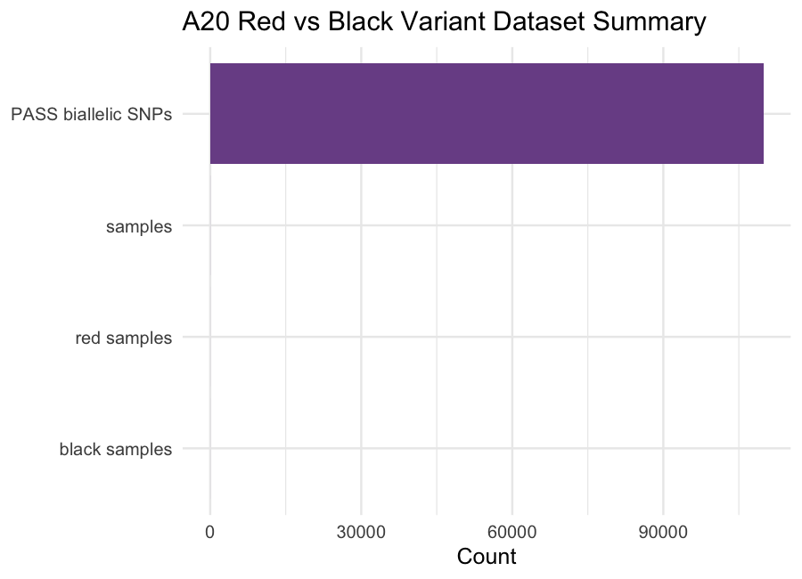
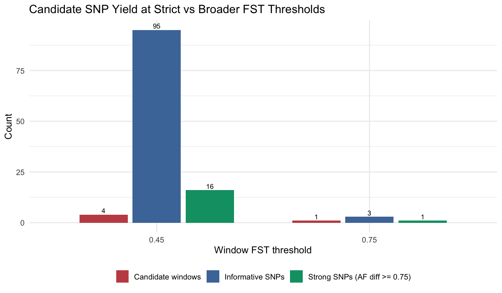

# Chromosome A20 DNA-seq Plot Interpretation: Red vs Black Carp

This report explains the figures generated from the chromosome A20 variant analysis for the red-vs-black fish comparison. The plots were made from the filtered SNP callset:

- VCF: `results/gatk_chrA20/filtered/red_black_A20.PASS.biallelic_snps.vcf.gz`
- Main plotting script: `scripts/plot_a20_variants.R`
- Samples: 5 red fish and 5 black fish from chromosome A20 (`NC_056591.1`)
- Variant set used for plotting: 109,849 PASS biallelic SNPs

The plots are best interpreted as chromosome-level evidence for genetic differentiation between the red and black groups. Because this project analyzed only one chromosome and a small sample size, the results can suggest candidate regions, but they should not be treated as proof of a causal color mutation.

## Figure 1. Windowed FST Across Chromosome A20



**File:** `results/gatk_chrA20/plots/a20_windowed_fst_100kb.png`

This plot shows FST across chromosome A20 using 100 kb genomic windows. FST measures genetic differentiation between groups. In this project, the two groups are red fish and black fish. A low FST value means the red and black groups have similar allele frequencies in that region. A high FST value means allele frequencies differ more strongly between the two color groups.

The updated plot includes two dashed guide lines. The `0.75` line marks the strict top-peak threshold, and the `0.45` line marks a broader candidate-window threshold. The top peak is labeled directly on the plot with its strongest SNP: `NC_056591.1:14557124 T>A`.

The strongest window is:

| Chromosome | Window start | Window end | Informative SNPs | Mean absolute allele-frequency difference | FST |
|---|---:|---:|---:|---:|---:|
| NC_056591.1 / A20 | 14,500,001 | 14,600,000 | 3 | 0.583 | 0.750 |

This is the only window with FST above 0.6. It is therefore the most visually striking candidate region in the A20 scan.

However, the key limitation is that this window has only 3 informative SNPs used in the FST calculation. A high FST estimate based on only a few SNPs is less reliable than a high FST estimate based on many SNPs. This point should be described as a candidate signal rather than a confirmed color locus.

Other high-FST windows were:

| Chromosome | Window start | Window end | Informative SNPs | FST |
|---|---:|---:|---:|---:|
| NC_056591.1 / A20 | 13,900,001 | 14,000,000 | 27 | 0.505 |
| NC_056591.1 / A20 | 4,400,001 | 4,500,000 | 25 | 0.497 |
| NC_056591.1 / A20 | 4,500,001 | 4,600,000 | 40 | 0.477 |

These are also possible regions of red-vs-black differentiation on A20, and they have more informative SNPs than the top 14.5-14.6 Mb window.

Using a broader FST threshold of `0.45` gives four candidate windows instead of one. Together, those four windows contain 95 informative SNPs for the FST calculation and 16 strong SNPs with `|red allele frequency - black allele frequency| >= 0.75`.

## Candidate Mutation And Annotation In The FST > 0.6 Window

The high-FST window spans `NC_056591.1:14500001-14600000`. The SNPs in this window were:

| Position | Ref | Alt | Red called alleles | Black called alleles | Red alt frequency | Black alt frequency | Interpretation |
|---:|---|---|---:|---:|---:|---:|---|
| 14,503,861 | A | C | 10 | 10 | 1.00 | 1.00 | Fixed alternate allele in both groups; not red-vs-black differentiated. |
| 14,538,587 | C | T | 2 | 2 | 1.00 | 1.00 | Fixed alternate allele in called samples from both groups; not red-vs-black differentiated. |
| 14,539,170 | G | A | 0 | 2 | NA | 1.00 | Only black group called; not usable for red-vs-black frequency comparison. |
| 14,556,744 | T | G | 0 | 2 | NA | 1.00 | Only black group called; not usable for red-vs-black frequency comparison. |
| 14,556,773 | C | A | 0 | 2 | NA | 1.00 | Only black group called; not usable for red-vs-black frequency comparison. |
| 14,557,124 | T | A | 4 | 2 | 0.00 | 1.00 | Strongest differentiated SNP in this window, but based on few called alleles. |
| 14,576,354 | G | C | 4 | 4 | 0.50 | 0.00 | Moderate red-vs-black allele-frequency difference. |
| 14,576,395 | C | A | 4 | 4 | 0.25 | 0.00 | Smaller red-vs-black allele-frequency difference. |

The best candidate SNP from this window is:

| Candidate SNP | Why it stands out | Important caution |
|---|---|---|
| `NC_056591.1:14557124 T>A` | Red alternate allele frequency = 0.00; black alternate allele frequency = 1.00 | Only 4 red alleles and 2 black alleles were called, so this is based on very few genotypes. |

Based on the RefSeq GFF annotation file `references/carp_refseq/GCF_018340385.1_ASM1834038v1_genomic.gff.gz`, this candidate SNP is not inside a confirmed protein-coding exon. It is approximately 3.8 kb upstream of pseudogene `LOC122149054`, which spans `NC_056591.1:14560938-14579623`.

The same high-FST window also contains or overlaps these annotated features:

| Feature | Coordinates on A20 | Annotation | Relationship to high-FST SNPs |
|---|---:|---|---|
| `LOC109045109` | 14,501,039-14,503,415 | Protein-coding gene; product annotated as forkhead box protein F2-like | In the same 100 kb high-FST window, but the differentiated SNPs are downstream of this gene. The nearby `14503861 A>C` SNP is close to this gene but is fixed in both red and black groups, so it does not explain the color-group difference. |
| `LOC122149053` | 14,511,235-14,512,793 | Pseudogene | In the same window; no strongest differentiated SNP directly assigned as a coding change. |
| `LOC122149054` | 14,560,938-14,579,623 | Pseudogene | The SNPs at `14576354 G>C` and `14576395 C>A` fall inside this pseudogene interval. The strongest SNP, `14557124 T>A`, is upstream of it. |
| `LOC122149055` | 14,583,810-14,603,796 | Pseudogene | Begins near the right edge of the high-FST window. |

**Inference:** the FST > 0.6 point most likely marks a small candidate region on chromosome A20 where the red and black groups differ in allele frequency. The most differentiated individual SNP is `NC_056591.1:14557124 T>A`, but the current analysis does not show that this SNP changes a protein sequence. The nearby forkhead box F2-like gene is biologically interesting because forkhead-box genes encode transcription factors, but the differentiated SNPs are not clearly inside that gene. Therefore, the safest conclusion is that this window may tag linked variation near regulatory or pseudogene-rich sequence, not that it identifies a confirmed pigmentation mutation.

To strengthen this inference, the next checks would be to inspect read depth and genotype quality at `14557124`, annotate the SNPs with SnpEff or Ensembl VEP if a compatible carp annotation is available, and test whether the same region remains differentiated when more chromosomes or more samples are included.

## Figure 2. Mean Absolute Allele-Frequency Difference



**File:** `results/gatk_chrA20/plots/a20_windowed_af_difference_100kb.png`

This plot shows the average absolute allele-frequency difference between red and black fish in each 100 kb window. It is related to FST but easier to interpret directly: larger values mean that the red and black groups carry different allele frequencies in that window.

The same `14.5-14.6 Mb` region stands out here, with a mean absolute allele-frequency difference of about 0.583. This supports the FST plot because both metrics point to the same region. The result suggests that this window contains SNPs where the red and black fish are genetically different.

The caution is the same as for the FST plot: the strongest window has only 3 informative SNPs, so it may be sensitive to missing data or genotype uncertainty.

## Figure 2B. Windowed FST With SNP Density



**File:** `results/gatk_chrA20/plots/a20_fst_with_snp_density_100kb.png`

This combined plot overlays two pieces of information on the same chromosome A20 coordinate system:

- Orange line and points: windowed FST for red vs black fish.
- Blue density strips along the top and bottom: number of PASS biallelic SNPs in each 100 kb window. Darker blue means more SNPs in that window.

This plot helps separate two questions that are easy to mix up. SNP density asks how many SNPs were found in a region. FST asks how different red and black fish are in that region. A region can have many SNPs but low FST if red and black have similar allele frequencies. A region can also have few SNPs but high FST if those SNPs differ strongly between groups.

The top FST peak at 14.5-14.6 Mb remains visually obvious, but the density strips show why it should be interpreted carefully: the FST signal is strong but based on only 3 informative SNPs. The broader candidate windows near 4.4-4.6 Mb and 13.9-14.0 Mb have lower FST values but more informative SNP support.

## Figure 3. Top Individual Allele-Frequency Differences



**File:** `results/gatk_chrA20/plots/a20_top_af_differences.png`

This plot shows individual SNPs with the largest allele-frequency differences between red and black fish. These are sites where one group has much more of the alternate allele than the other group.

Several SNPs show very large differences, including some with apparent red-vs-black alternate allele frequency differences near 1.0. These SNPs are useful as candidate markers, but individual-SNP plots are especially sensitive to missing genotype calls. A SNP can look perfectly differentiated if only a few individuals were successfully genotyped.

For this reason, individual SNP candidates should be interpreted together with:

- number of called alleles in each color group,
- genotype quality,
- read depth,
- whether the SNP lies inside a gene, exon, intron, or regulatory region,
- whether neighboring SNPs show the same pattern.

The SNP `NC_056591.1:14557124 T>A` is the most important individual site inside the FST > 0.6 window, but it should be treated as a candidate marker rather than a proven causal mutation.

## Figure 4. PCA Of A20 SNP Genotypes



**File:** `results/gatk_chrA20/plots/a20_pca_red_black.png`

The PCA plot summarizes genome-wide similarity among the 10 samples using SNP genotypes from chromosome A20. Each point is one fish. Samples that cluster close together have more similar A20 genotypes.

The PCA does not show a clean separation of all red samples from all black samples. Some red and black fish cluster near each other. For example, several red samples are close to black samples on the first two principal components, while `red_15` and `black_5` are also very close to each other.

This means chromosome A20 does not contain a simple genome-wide red-vs-black separation signal across the whole chromosome. Instead, the stronger evidence comes from specific local windows, especially the high-FST region near 14.5-14.6 Mb.

**Finding:** color group is not the only major source of genetic variation on A20. Some samples from different color groups are genetically similar across this chromosome, which may reflect shared ancestry, relatedness, population structure, or the fact that color differences may be controlled by specific loci rather than the whole chromosome.

## Figure 5. SNP Density Across Chromosome A20



**File:** `results/gatk_chrA20/plots/a20_snp_density_100kb.png`

This plot shows how many filtered SNPs were found in each 100 kb window across chromosome A20. SNP density is a quality-control and context plot. It does not directly show red-vs-black differentiation, but it helps interpret whether peaks in FST or allele-frequency difference are supported by many variants or only a few.

The chromosome contains many windows with hundreds of SNPs. In contrast, the top FST window at `14.5-14.6 Mb` has only 3 informative SNPs for the FST calculation. This is why the high FST value is interesting but should be handled cautiously.

Regions with unusually low SNP density can occur because of low read depth, repetitive sequence, mapping difficulty, strict filtering, or true low genetic variation. Regions with very high SNP density may reflect real variation, but they can also occur in repetitive or difficult-to-map regions.

## Figure 6. Variant Summary



**File:** `results/gatk_chrA20/plots/a20_variant_summary.png`

This plot was updated to make it biologically relevant to the red-vs-black comparison. Instead of only showing the number of samples and total SNPs, it now groups A20 SNPs by whether the alternate allele is more common in red fish, more common in black fish, similar between groups, or missing from one color group.

| Category | SNPs | Percent |
|---|---:|---:|
| Higher alternate allele frequency in red | 11,346 | 10.33 |
| Higher alternate allele frequency in black | 11,137 | 10.14 |
| Similar red and black allele frequency | 84,889 | 77.28 |
| Missing one color group | 2,477 | 2.25 |

Most SNPs are similar between red and black fish, which is expected because the two groups are the same species and share most of their genome. The biologically interesting SNPs are the smaller sets where allele frequencies differ between red and black. This makes the summary plot better aligned with the project question.

The old dataset-count summary is still retained in:

```text
results/gatk_chrA20/tables/a20_dataset_summary.tsv
```

The table corresponding to the updated plot is:

```text
results/gatk_chrA20/tables/a20_variant_summary.tsv
```

## Figure 7. FST Threshold Comparison



**File:** `results/gatk_chrA20/plots/a20_fst_threshold_comparison.png`

This plot compares two ways of choosing candidate regions from the FST scan:

| FST threshold | Candidate 100 kb windows | Informative SNPs in candidate windows | Strong SNPs with `|Red AF - Black AF| >= 0.75` |
|---:|---:|---:|---:|
| 0.75 | 1 | 3 | 1 |
| 0.45 | 4 | 95 | 16 |

The strict `0.75` threshold identifies only the highest peak. This is useful because it highlights the most extreme red-vs-black differentiation on A20, but it is fragile because it is based on only 3 informative SNPs.

The broader `0.45` threshold identifies four candidate windows. This is more useful for biological interpretation because it captures regions with more SNP support:

| Candidate region | FST | Informative SNPs | Nearby annotation | Interpretation |
|---|---:|---:|---|---|
| A20:4.4-4.5 Mb | 0.497 | 25 | `LOC109112681`, AT-rich interactive domain-containing protein 1B-like | Candidate differentiated block; possible linked or regulatory variation, not a proven color mutation. |
| A20:4.5-4.6 Mb | 0.477 | 40 | `LOC109112681` and nearby pseudogene-rich sequence | Adjacent to the 4.4-4.5 Mb window, possibly part of the same broader differentiated region. |
| A20:13.9-14.0 Mb | 0.505 | 27 | `LOC109112719`, uncharacterized protein-coding gene; nearby cytochrome P450 2J3-like | Candidate region with more SNP support than the top peak, but no confirmed pigmentation gene from this analysis alone. |
| A20:14.5-14.6 Mb | 0.750 | 3 | forkhead box protein Q1-like and F2-like genes nearby; pseudogene `LOC122149054` | Highest peak, strongest SNP `NC_056591.1:14557124 T>A`, but limited by few informative SNPs. |

The candidate SNP table for the broader threshold is:

```text
results/gatk_chrA20/tables/a20_candidate_snps_fst_ge_0_45_abs_af_diff_ge_0_75.tsv
```

The candidate region table is:

```text
results/gatk_chrA20/tables/a20_candidate_regions_fst_ge_0_45.tsv
```

## Overall Findings

The chromosome A20 analysis found one standout window with FST above 0.6:

| Main result | Interpretation |
|---|---|
| `NC_056591.1:14500001-14600000`, FST = 0.75 | Strong candidate red-vs-black differentiated region on chromosome A20. |
| Only 3 informative SNPs in the top FST window | The peak is fragile and needs validation. |
| Best candidate SNP: `NC_056591.1:14557124 T>A` | Black fish had alternate allele frequency 1.00 and red fish had alternate allele frequency 0.00 among called alleles, but only a few alleles were called. |
| Nearby annotation | The candidate SNP is upstream of pseudogene `LOC122149054`; nearby SNPs also fall in a pseudogene-rich region. The protein-coding gene `LOC109045109`, annotated as forkhead box protein F2-like, is in the same 100 kb window but not directly hit by the differentiated SNPs. |
| PCA result | Red and black fish do not fully separate across all A20 SNPs, suggesting local differentiation rather than chromosome-wide separation. |

The best biological interpretation is that chromosome A20 contains candidate regions where red and black fish differ genetically. The strict top signal is near 14.5-14.6 Mb, while the broader `FST >= 0.45` threshold adds candidate regions near 4.4-4.6 Mb and 13.9-14.0 Mb. The most notable candidate mutation from the top high-FST window is `NC_056591.1:14557124 T>A`, but the evidence is not strong enough to claim it causes red or black coloration. It is better described as a candidate marker near pseudogene-rich sequence and near forkhead box gene annotations.

For a final project presentation, the most defensible wording is:

> On chromosome A20, the red and black groups showed several candidate differentiation regions. The strongest FST peak was at 14.5-14.6 Mb, where the strongest SNP was `NC_056591.1:14557124 T>A`. The broader `FST >= 0.45` threshold identified four candidate windows and 16 strong SNPs with large red-vs-black allele-frequency differences. These SNPs may tag regions linked to color-group differences, but because several signals have limited called genotypes and the analysis covers only chromosome A20, they should be interpreted as candidate markers rather than confirmed causal pigmentation mutations.
